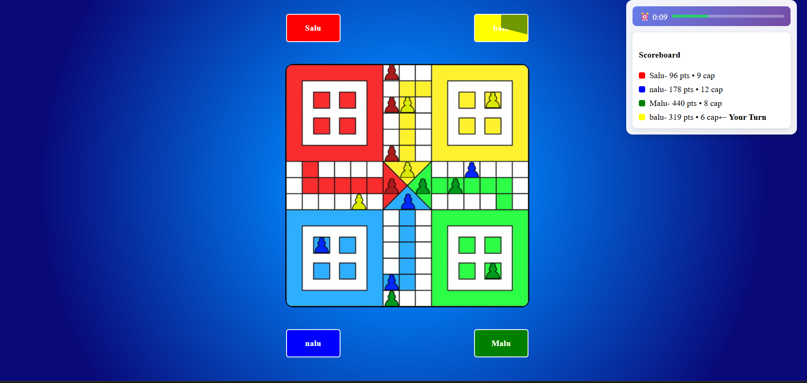
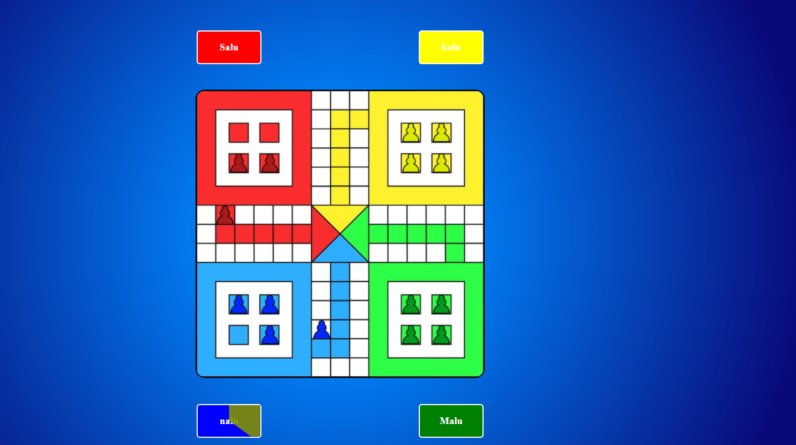

  
# MERN Ludo – Real-Time Scoring Extension

This project is my implementation of the **QreateAI Full Stack Developer Intern Assignment**.  
It is a fork of the original MERN Ludo repository, extended with a **real-time scoring system**, an improved **scoreboard UI**, and a **turn timer**, all fully synchronized across players.

---

## What I Implemented

### 🔹 Backend Logic for Scoring & Captures
- **Pawn Movement Scoring:** Each pawn move adds points equal to the dice roll, ensuring progress is rewarded in real time.  
- **Capture Rule:**  
  - Attacker gains all of the captured pawn’s points.  
  - Captured pawn resets to base with score reset to zero.  
  - Capture count is tracked for tie-breaker cases.  
- **Live Score Aggregation:** Player scores are the sum of all pawn points, updated instantly through Socket.IO events.  
- **Winner Determination:** At the end of the timer, the player with the highest score is declared the winner (tie-breaker = capture count).

### 🔹 Frontend Enhancements
- **Scoreboard Panel (Top-Right):** Displays each player’s score, captures, and highlights the active turn.  
- **Turn Timer:** A real-time countdown ensures smooth gameplay and keeps turns fast-paced.  
- **Responsive Board Layout:** The Ludo board remains centered and scales well across different screen sizes.  
- **Winner Overlay:** At game end, a clear overlay announces the winner along with their score.  
- Both **new UI** (with scoreboard & timer) and the **original UI** are included in this repo.

---

## Key Highlights
- Core Ludo mechanics remain intact. The scoring system is **modular and independent** of game logic.  
- Real-time synchronization ensures **scores and captures update instantly** for all players.  
- Simple, intuitive UI that makes the game state easy to follow.  
- Player colors mapped for clarity:  
  - **Red → Salu**  
  - **Blue → Nalu**  
  - **Green → Malu**  
  - **Yellow → Balu**

---

## Screenshots

### ✅ New UI with Live Scoreboard & Timer

### 🎲 Classic Old UI

---

## Summary
This project extends the base MERN Ludo game with a **unique real-time scoring system** and an **engaging UI**.  
Every pawn move and capture now contributes to dynamic scoring, which is broadcast live to all players.  
The result is a **smooth, competitive, and interactive multiplayer Ludo experience** that fulfills the assignment requirements.

👉 [My Implementation Repo](https://github.com/vipinsao/MERN-Ludo-Assignment)

